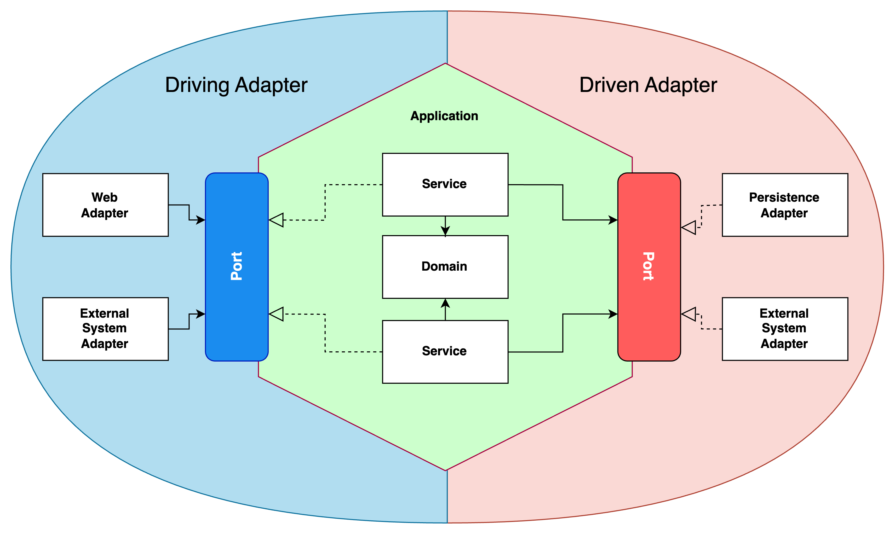

<div align="center">
  <h1>hexagonal-architecture-with-spring-boot-practice</h1>
</div>

> [CMC 컨퍼런스 발표 자료](https://drive.google.com/file/d/1a6rPCEZW-yQB-x1VWvZL28xUC4CkRez-/view?usp=sharing)



- 포트에 맞는 어댑터를 구현하여 `저수준 모듈`(세부 구현 기술, 외부 인프라 기술...)이 `고수준 모듈`(서비스 & 도메인 계층)에 의존하도록 의존성을 역전시킨다.
- 도메인은 세부 구현기술을 모르기 때문에 안전하게 보호받을 수 있다.

## 패키지 구조
```text
.
├── java
│   └── com
│       └── demo
│           └── architecture
│               ├── ArchitectureApplication.java
│               └── product
│                   ├── adapter
│                   │   ├── in
│                   │   │   ├── app
│                   │   │   │   ├── ProductAppController.java
│                   │   │   │   └── response
│                   │   │   │       └── StartSaleProductAppRes.java
│                   │   │   └── web
│                   │   │       ├── ProductWebController.java
│                   │   │       └── response
│                   │   │           └── StartSalesProductWebRes.java
│                   │   └── out
│                   │       └── persistence
│                   │           ├── InitProduct.java
│                   │           ├── ProductJpaEntity.java
│                   │           ├── ProductJpaRepository.java
│                   │           ├── ProductMapper.java
│                   │           ├── ProductPersistenceAdapter.java
│                   │           └── SalesStatusJpa.java
│                   ├── application
│                   │   ├── command
│                   │   │   └── StartSalesProductCommand.java
│                   │   ├── port
│                   │   │   ├── in
│                   │   │   │   └── SalesProductUseCase.java
│                   │   │   └── out
│                   │   │       ├── LoadProductPort.java
│                   │   │       └── SaveProductPort.java
│                   │   └── service
│                   │       └── SalesProductService.java
│                   ├── domain
│                   │   ├── Product.java
│                   │   ├── ProductInfo.java
│                   │   ├── ProductMetaInfo.java
│                   │   ├── ProductSalesInfo.java
│                   │   └── SalesStatus.java
│                   └── exception
│                       └── NoProductException.java
└── resources
    └── application.yml
```

## 1️⃣ adapter

- in
  - 클라이언트 요청이 들어오는 부분을 구현한다.
  - Controller는 UseCase 인터페이스를 주입받고 메서드를 호출한다.
- out
  - 데이터베이스나 외부 시스템과 연동하는 부분을 구현한다.
  - 현재 프로젝트에서 Spring Data JPA 구현체가 위치하고 있다.
- mapper
  - 엔티티와 도메인 객체를 맵핑하는 로직을 작성한다.

## 2️⃣ application
- command
  - application 계층에서 사용하는 DTO 클래스다.
- port
  - in
    - 클라이언트가 호출하는 인터페이스가 위치한다. 진입 포트 역할을 한다.
  - out
    - 데이터베이스나 외부 인프라 시스템이 구현해야 하는 인터페이스가 위치한다. 진출 포트 역할을 한다.
- service
  - 응용 서비스 구현체가 위치한다.
  
## 3️⃣ domain
  - 우리 서비스에서 제일 중요하고 보호되어야 하는 도메인 모델이 위치한다.
  - 루트 도메인과 하위 도메인으로 구성된다.
  - 도메인 로직을 작성하여 응집도를 높일 수 있다.
  - 핵심 정책들을 관리하기 용이하다. 또한 외부 기술로부터 정책을 보호할 수 있다.

## 코드 설명

### Controller

- application 계층에서 정의한 포트를 호출한다.
```java
@RestController
@RequiredArgsConstructor
@RequestMapping("/web/products")
class ProductWebController {

  private final SalesProductUseCase salesProductUsecase;

  /**
   * 상품 판매 시작하기
   * @param productId
   * @return
   */
  @PostMapping("/sale/{product-id}")
  public ResponseEntity<StartSalesProductWebRes> startSalesProduct(@PathVariable(value = "product-id") Long productId) {
    salesProductUsecase.startSalesProduct(StartSalesProductCommand.builder()
            .productId(productId)
            .build());
    return ResponseEntity.ok(new StartSalesProductWebRes("[WEB] " + productId + "번 상품 판매가 시작되었습니다."));
  }
}
```

### Service

- 이후 조회 성능을 높이기 위해 조회와 쿼리 책임을 분리하는 CQRS 패턴을 적용함
- `Product` 도메인 객체에게 도메인 로직 처리를 위임한다.
```java
@Service
@RequiredArgsConstructor
@Transactional
class SalesProductService implements SalesProductUseCase {

  private final LoadProductPort loadProductPort;
  private final SaveProductPort saveProductPort;

  @Override
  public void startSalesProduct(StartSalesProductCommand cmd) {
    Product product = loadProductPort.findById(cmd.getProductId());
    product.startSales();
    saveProductPort.save(product);
  }
}
```

### Domain

- 하위 도메인들로 구성된다.
- 도메인 내부의 데이터를 변경은 반드시 루트 애그리거트(`Product`)를 통해서만 가능하도록 구현한다.
- setter를 pulbic으로 만들지 않고 데이터를 변경할 때 새로운 객체를 생성하여 교체하도록 한다.
```java
public class Product {

  private Long productId;
  private ProductInfo productInfo;
  private ProductSalesInfo productSalesInfo;
  private ProductMetaInfo productMetaInfo;

  @Builder(builderMethodName = "withId")
  public Product(Long productId, ProductInfo productInfo, ProductSalesInfo productSalesInfo, ProductMetaInfo productMetaInfo) {
    this.productId = productId;
    this.productInfo = productInfo;
    this.productSalesInfo = productSalesInfo;
    this.productMetaInfo = productMetaInfo;
  }

  public void startSales() {
    this.productSalesInfo = ProductSalesInfo.withStatus().status(SalesStatus.SALES).build();
  }

  public void stopSales() {
    this.productSalesInfo = ProductSalesInfo.withStatus().status(SalesStatus.SALES_DISCONTINUED).build();
  }
  ...
}
```

### PersistenceAdapter

- 어댑터에서 Spring Data JPA 구현체를 호출하여 엔티티를 관리한다.
- application 계층으로 엔티티를 넘기지 않고 도메인 객체로 맵핑하여 반환한다.

> [!NOTE]
> **도메인 모델과 엔티티를 하나로 통일해도 되지 않을까?**
> 
> 하나로 합쳐서 사용한다면 도메인 모델이 세부 구현 기술에 의존하게 된다. 이는 헥사고날 아키텍처를 사용하는 목적에 맞지 않는다고 생각된다. 따라서 도메인 모델과 엔티티를 분리하는 것이 옳은 선택인 것 같다. 

```java
@Repository
@RequiredArgsConstructor
class ProductPersistenceAdapter implements LoadProductPort, SaveProductPort {

  private final ProductJpaRepository productRepository;
  private final ProductMapper mapper;

  @Override
  public Product findById(Long productId) {
    ProductJpaEntity productJpaEntity = productRepository.findById(productId).orElseThrow(NoProductException::new);
    return mapper.toDomain(productJpaEntity);
  }

  @Override
  public void save(Product product) {
    ProductJpaEntity target = mapper.toJpaEntity(product);
    ProductJpaEntity productJpaEntity = productRepository.findById(product.getProductId()).orElseThrow(NoProductException::new);
    productJpaEntity.update(target);
  }
}
```

### mapper

- 엔티티와 도메인 모델간 맵핑을 위한 추가적인 로직이 필요하다.
- 클린 아키텍처를 만들기 위해 이와 같은 작업들이 추가된다.
```java
@Component
@NoArgsConstructor(access = AccessLevel.PROTECTED)
class ProductMapper {

  public Product toDomain(ProductJpaEntity productJpaEntity) {
    return Product.withId()
            .productId(productJpaEntity.getId())
            .productInfo(ProductInfo.builder()
                    .productName(productJpaEntity.getProductName())
                    .seller(productJpaEntity.getSeller())
                    .build())
            .productMetaInfo(ProductMetaInfo.builder()
                    .price(productJpaEntity.getPrice())
                    .quantity(productJpaEntity.getQuantity())
                    .build())
            .productSalesInfo(ProductSalesInfo.withStatus()
                    .status(SalesStatus.valueOf(productJpaEntity.getStatus().toString()))
                    .build())
            .build();
  }

  public ProductJpaEntity toJpaEntity(Product product) {
    return ProductJpaEntity.builder()
            .productName(product.getProductInfo().getProductName())
            .seller(product.getProductInfo().getSeller())
            .price(product.getProductMetaInfo().getPrice())
            .quantity(product.getProductMetaInfo().getQuantity())
            .status(SalesStatusJpa.valueOf(product.getProductSalesInfo().getStatus().toString()))
            .build();
  }
}
```
