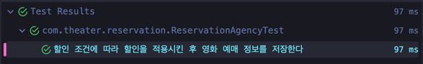

## 데이터 중심 설계

객체 내부에 저장되는 데이터를 기반으로 시스템을 만들어 나가는 방식이다. 객체가 저장해야 하는 데이터가 무엇인가를 생각하며 설계를 진행시켜 나가는 방식이다.
아래 영화 예매 서비스 로직을 보자.

```java
public class ReservationAgency {

    public Reservation reserve(Screening screening, Customer customer, int audienceCount) {
        Movie movie = screening.getMovie();

        boolean discountable = false;
        for (DiscountCondition condition : movie.getDiscountConditions()) {
            if (condition.getType() == DiscountConditionType.PERIOD) {
                discountable = screening.getWhenScreened().getDayOfWeek().equals(condition.getDayOfWeek()) &&
                        condition.getStartTime().compareTo(screening.getWhenScreened().toLocalTime()) <= 0 &&
                        condition.getEndTime().compareTo(screening.getWhenScreened().toLocalTime()) >= 0;
            } else {
                discountable = condition.getSequence() == screening.getSequence();
            }

            if (discountable) {
                break;
            }
        }

        Money fee;
        if (discountable) {
            Money discountAmount = Money.ZERO;
            switch (movie.getMovieType()) {
                case AMOUNT_DISCOUNT:
                    discountAmount = movie.getDiscountAmount();
                    break;
                case PERCENT_DISCOUNT:
                    discountAmount = movie.getFee().times(movie.getDiscountPercent());
                    break;
                case NONE_DISCOUNT:
                    discountAmount = Money.ZERO;
                    break;
            }

            fee = movie.getFee().minus(discountAmount);
        } else {
            fee = movie.getFee();
        }

        return new Reservation(customer, screening, fee, audienceCount);
    }
}
```

`Reservation` 객체를 생성하기 위해 할인 여부를 판단하고 할인이 가능한 경우 적절한 할인 조건을 찾아 영화의 금액을 계산하는 로직이 하나의 메서드에 작성되어있다.
위 코드는 변경에 취약하고 캡슐화가 되어있지 않았다. 그리고 거의 대부분의 데이터에 의존하고 있다. Screening, Movie, DiscountCondition 등 모든 데이터를 참조하고 있고 메서드를 사용하고 있다.
그 중 어느 하나의 클래스에 변경이 생긴다면 ReservationAgency 클래스에는 변경이 필연적으로 발생할 수 밖에 없다. 너무 높은 결합도로 인해 발생한 문제이다.

```java
        Movie movie = screening.getMovie();

        boolean discountable = false;
        for (DiscountCondition condition : movie.getDiscountConditions()) {
            if (condition.getType() == DiscountConditionType.PERIOD) {
                discountable = screening.getWhenScreened().getDayOfWeek().equals(condition.getDayOfWeek()) &&
                        condition.getStartTime().compareTo(screening.getWhenScreened().toLocalTime()) <= 0 &&
                        condition.getEndTime().compareTo(screening.getWhenScreened().toLocalTime()) >= 0;
            } else {
                discountable = condition.getSequence() == screening.getSequence();
            }

            if (discountable) {
                break;
            }
        }
```

위 코드에서 알 수 있는 사실로는 `DiscountCondition` 클래스 내부에 어떤 필드들이 존재하는지 get 메서드를 통해 파악할 수 있다는 점이다.
이는 내부 구현이 퍼블릭 인터페이스에 노출되어 있음을 의미한다. 또한 할인 조건의 타입을 `ReservationAgency` 객체가 알고 있어야 하는지도 의문이다.
만약 할인 조건이 바뀐다면 위 코드의 조건문도 변경되어야 할 것이다.

```java
        Money fee;
        if (discountable) {
            Money discountAmount = Money.ZERO;
            switch (movie.getMovieType()) {
                case AMOUNT_DISCOUNT:
                    discountAmount = movie.getDiscountAmount();
                    break;
                case PERCENT_DISCOUNT:
                    discountAmount = movie.getFee().times(movie.getDiscountPercent());
                    break;
                case NONE_DISCOUNT:
                    discountAmount = Money.ZERO;
                    break;
            }

            fee = movie.getFee().minus(discountAmount);
        } else {
            fee = movie.getFee();
        }
```

위 코드는 할인이 가능하다면 영화의 타입에 따라 적절한 할인 정책에 따라 가격에 할인이 되는 로직이다.

여기서도 `Movie` 클래스 내부에는 `fee`라는 필드가 존재함을 알 수 있다. 

마찬가지로 이는 캡슐화가 제대로 되어 있지 않음을 의미한다. 만약 fee가 아닌 다른 변수를 사용한다면? `getFee()` 메서드를 사용하는 모든 클래스의 코드에는 수정이 불가피하다.
`getFee()` 메서드 하나로 인해 Movie 클래스 내부를 마음대로 변경하기 부담스러운 상황이다. 또한 변경에 매우 취약하다.
할인 정책은 변경 가능성이 매우 높다. 그러나 위 코드에서는 할인 조건에 따라 다른 할인을 적용하기 위해 조건문을 사용하고 있다.
할인 조건을 추가한다면 우리는 `ReservationAgency` 클래스의 코드를 반드시 수정할 수 밖에 없다.


즉 변경이 힘든 코드로 인해 할인정책을 마음대로 추가하거나 삭제할 수 없는 상황이다.

이 모든 문제점들은 캠슐화가 제대로 안되어 있기 때문이고, 그로 인해 응집도는 낮아지고 결합도는 높은 상태가 된 것이다. 
지금부터는 캡슐화 원칙을 지키며 변경에 용이하도록 코드를 변경해 볼 것이다.

## 책임 주도 설계

위에서 본 ReservationAgency 클래스는 너무 높은 결합도로 인해 변경에 취약한 상태이다. 책임을 적절하게 분산시켜 결합도를 낮추고 캡슐화를 지키는 코드로 변경할 것이다.

### 👉 캡슐화를 지켜라

속성을 private으로 설정하였지만 접근자, 수정자를 통해 외부로 속성을 제공한다면 캡슐화를 위반한 것이다.

### 👉 스스로 자신의 데이터를 책임지는 객체

- DiscountCondition

순번 할인을 적용하기 위해서는 sequence, 기간 할인을 적용하기 위해서는 dayOfWeek, time값이 필요하다.
이 값들은 모두 DiscountCondition 객체가 가지고 있는 데이터이다.
따라서 할인 조건을 만족하는지 검사하는 메서드를 DiscountCondition 클래스로 이동시키자.

```java
    public boolean isDiscountable(DayOfWeek dayOfWeek, LocalTime time) {
        if (type != DiscountConditionType.PERIOD) {
            throw new IllegalArgumentException();
        }

        return this.dayOfWeek.equals(dayOfWeek) &&
                this.startTime.compareTo(time) <= 0 &&
                this.endTime.compareTo(time) >= 0;
    }

    public boolean isDiscountable(int sequence) {
        if (type != DiscountConditionType.SEQUENCE) {
            throw new IllegalArgumentException();
        }

        return this.sequence == sequence;
    }
```

- Movie

영화의 할인 조건에 따라 할인 가능 여부를 확인하는 책임을 `Movie` 클래스에 위임한다.

```java
    public boolean isDiscountable(LocalDateTime whenScreened, int sequence) {
        for (DiscountCondition condition : discountConditions) {
            if (condition.getType() == DiscountConditionType.PERIOD) {
                if (condition.isDiscountable(whenScreened.getDayOfWeek(), whenScreened.toLocalTime())) {
                    return true;
                }
            } else {
                if (condition.isDiscountable(sequence)) {
                    return true;
                }
            }
        }
        return false;
    }
```

- Screening

```java
    public Money calculateFee(int audienceCount) {
        switch (movie.getMovieType()) {
            case AMOUNT_DISCOUNT:
                if (movie.isDiscountable(whenScreened, sequence)) {
                    return movie.calculateAmountDiscountFee().times(audienceCount);
                }
                break;
            case PERCENT_DISCOUNT:
                if (movie.isDiscountable(whenScreened, sequence)) {
                    return movie.calculatePercentDiscountFee().times(audienceCount);
                }
                break;
            case NONE_DISCOUNT:
                return movie.calculateNoneDiscountFee().times(audienceCount);
        }
        return movie.calculateNoneDiscountFee().times(audienceCount);
    }
```

영화의 타입에 따라 적절한 할인 방법을 적용시킬 수 있는지 검사하고 최종적으로 할인된 금액을 계산한다.

처음 코드와 다르게 각 객체가 수행해야 하는 오퍼레이션을 가지게 되었다. 최종적으로 `ReservationAgency`클래스의 코드는 아래와 같이 줄어들었다.

- ReservationAgency

```java
public class ReservationAgency {

    public Reservation reserve(Screening screening, Customer customer, int audienceCount) {
        Money fee = screening.calculateFee(audienceCount);
        return new Reservation(customer, screening, fee, audienceCount);
    }
}
```

테스트 코드를 통해 예매 기능이 제대로 동작하고 있음을 확인할 수 있다.



### ⛔️ 여전히 존재하는 문제점들

지금까지 데이터에 대한 오퍼레이션을 객체 내부로 이동시키면서 캡슐화가 된 것처럼 보이지만 사실 여전히 문제가 존재한다.

- DiscountCondition

```java
    public boolean isDiscountable(DayOfWeek dayOfWeek, LocalTime time) {
        if (type != DiscountConditionType.PERIOD) {
            throw new IllegalArgumentException();
        }
        return this.dayOfWeek.equals(dayOfWeek) &&
            this.startTime.compareTo(time) <= 0 &&
            this.endTime.compareTo(time) >= 0;
    }

    public boolean isDiscountable(int sequence) {
        if (type != DiscountConditionType.SEQUENCE) {
            throw new IllegalArgumentException();
        }
        return this.sequence == sequence;
    }
```

첫번째 `isDiscountable` 메서드는 인자로 `dayOfWeek`, `time`을 전달받고 있고 이는 외부로 `DiscountCondition`클래스의 속성을 노출시키고 있는 것과 다름없는 것이다.
또한 두번째 메서드는 인자로 `sequence`를 전달받고 있다.

두 메서드 모두 외부로 객체 내부의 속성을 노출시키고 있다. 만약 객체 내부의 속성을 변경한다면 해당 메서드를 사용하는 모든 클라이언트의 메서드에도 인자를 수정해야 할 것이다.
객체가 스스로 데이터를 처리한다는 점에서 이전보다 개선되었지만 내부 구현을 완전히 캡슐화하지는 못했다.

- Movie

```java
    public Money calculateAmountDiscountFee() {
        if (movieType != MovieType.AMOUNT_DISCOUNT) {
            throw new IllegalArgumentException();
        }
        return fee.minus(discountAmount);
    }

    public Money calculatePercentDiscountFee() {
        if (movieType != MovieType.PERCENT_DISCOUNT) {
            throw new IllegalArgumentException();
        }
        return fee.minus(fee.times(discountPercent));
    }

    public Money calculateNoneDiscountFee() {
        if (movieType != MovieType.NONE_DISCOUNT) {
            throw new IllegalArgumentException();
        }
        return fee;
    }
```

다음 세 가지 메서드를 보면 할인 방법은 총 3가지가 있음을 쉽게 파악할 수 있다. 그리고 만약 새로운 할인 정책이 추가되거나 기존 정책이 수정된다면 클라이언트의 메서드에서도 반드시 변경의 파급효과에 영향을 받게된다.
즉 내부 구현을 완전히 캡슐화 하지 못한 것이다.

```java
    public boolean isDiscountable(LocalDateTime whenScreened, int sequence) {
        for (DiscountCondition condition : discountConditions) {
            if (condition.getType() == DiscountConditionType.PERIOD) {
                if (condition.isDiscountable(whenScreened.getDayOfWeek(), whenScreened.toLocalTime())) {
                    return true;
                }
            } else {
                if (condition.isDiscountable(sequence)) {
                    return true;
                }
            }
        }
        return false;
    }
```

위 메서드에도 문제가 있다.

`Movie` 객체의 `discountConditions` 목록을 돌며 할인 조건에 따라 적합한 메서드를 호출하고 있다.
만약 할인 조건의 타입이 `PERIOD`에서 다른 타입으로 변경된다면 코드에 수정이 발생한다.
또한 조건에 따라 호출하는 메서드의 인자도 모두 달리지므로 할인 조건을 임의로 변경하기가 어렵다는 것을 쉽게 느낄 수 있다.

- Screening

```java
    public Money calculateFee(int audienceCount) {
        switch (movie.getMovieType()) {
            case AMOUNT_DISCOUNT:
                if (movie.isDiscountable(whenScreened, sequence)) {
                    return movie.calculateAmountDiscountFee().times(audienceCount);
                }
                break;
            case PERCENT_DISCOUNT:
                if (movie.isDiscountable(whenScreened, sequence)) {
                    return movie.calculatePercentDiscountFee().times(audienceCount);
                }
                break;
            case NONE_DISCOUNT:
                return movie.calculateNoneDiscountFee().times(audienceCount);
        }
        return movie.calculateNoneDiscountFee().times(audienceCount);
    }
```

앞서 말한 DiscountCondition이 추가되거나 변경된다면 조건문이 변경돼야 한다.

**총정리를 하자면 DiscountCondition을 추가하거나 변경한다면 Movie, Screening 객체 모두 영향을 받아 수정이 발생한다. 이는 여전히 높은 결합도, 낮은 응집도를 지니고 있기 때문이다.**


### 👉 캡슐화의 진정한 의미

캡슐화는 변할 수 있는 모든 것을 감추는 행위를 의미한다. 내부 구현의 변경으로 외부의 객체가 영향을 받는다면 이는 완전한 캡슐화가 되지 못한다는 것을 의미한다.

### 👉 데이터 중심 설계의 문제점

앞서 봤듯이 객체의 행동이 아닌 상태에 초점을 맞춰 설계하다 보니 데이터를 먼저 정의하고 이후에 데이터를 처리하는 작업을 작성하게 된다.
그러다 보니 객체 내부 속성을 외부로 노출시키는 문제가 발생함을 알 수 있었다.

### GRASP 패턴

앞서 말한 문제점들을 해결하기 위해서는 객체에 책임을 할당해야 한다.
책임을 할당하는 과정에서 도움을 주는 패턴이 바로 GRASP(General Responsibility Assignment Software Pattern) 패턴이다.

1. 도메인 개념에서 출발하기
    - 책임을 할당받을 객체들의 종류와 관계에 대한 정보를 제공할 수 있다면 충분하다.
    - 도메인 개념을 정리하는 데 너무 많은 시간을 들이지 말고 빠르게 설계와 구현을 진행하라.
    - 도메인 모델은 도메인을 개념적으로 표현한 것이지만, 그 안에 포함된 개념과 관계는 구현의 기반이 돼야 한다. 즉 구현을 고려하여 도메인을 구조화하는 것은 바람직한 것이다.
2. 정보 전문가에게 책임을 할당하라
    - 애플리케이션이 책임을 수행하기 위해 필요한 메시지를 결정해야 한다.
    - 메시지를 수신할 객체가 아닌 전송할 객체의 의도를 반영하여 결정해야 한다.
    - 객체는 자신의 상태를 스스로 처리하는 자율적인 존재여야 한다. -> INFORMATION EXPERT 패턴
3. 높은 응집도와 낮은 결합도 -> LOW COUPLING, HIGH COHESION 패턴
4. 창조자에게 객체 생성 책임을 할당하라 -> CREATOR 패턴
   ```
   - B가 A 객체를 포함하거나 참조한다.
   - B가 A 객체를 기록한다.
   - B가 A 객체를 긴밀하게 사용한다.
   - B가 A 객체를 초기화하는 데 필요한 데이터를 가지고 있다.
   ```
   위 조건을 최대한 만족하는 B에게 객체 생성 책임을 할당하는 것이 좋다.
5. 구현을 통한 검증
    - 협력을 위한 메시지를 선언한다.
    - 이때 메시지의 수신자를 고려하지 않고 송신자의 관점에서 필요한 메시지를 작성해야 캡슐화와 높은 결합도 목표를 달성하기 쉬워진다.

### 👉 변경 위험 징후를 드러내는 패턴
1. 인스턴스 변수가 초기화되는 시점을 살펴보자.
    - 응집도가 높은 클래스는 인스턴스를 생성할 때 모든 속성을 함께 초기화한다.
    - 클래스의 속성이 서로 다른 시점에 초기화되거나 일부만 초기화된다는 것은 응집도가 낮다는 것을 의미한다.
    - 따라서 함께 초기화되는 속성을 기준으로 코드를 분리해야 한다.
2. 메서드들이 인스턴스 변수를 사용하는 방식을 살펴보자.
    - 속성 그룹과 해당 그룹에 접근하는 메서드 그룹을 기준으로 코드를 분리해야 한다.
    - 그러나 클래스를 분리하다 보면 결합도가 자연스럽게 증가한다.
    - 결합도를 낮추기 위해 다형성을 통해 분리하자. 이는 구체 클래스를 알지 못하는 상황에서 역할에 대해서만 결합되도록 의존성을 제한하는 방법이다.
    - 역할을 사용하여 객체의 구체적인 타입을 추상화할 수 있다.
    - 즉 객체의 암시적인 타입에 따라 행동을 분기해야 한다면 암시적인 타입을 명시적인 클래스로 정의하여 응집도 문제를 해결할 수 있다. -> POLYMORPHISM 패턴

### 👉 책임 주도 설계의 대안 -> 리팩토링
- 책임 주도 설계에 익숙해지기 위해서는 내공이 필요하다.
- 이로 인해 어려움을 겪고 있을 때 해결책은 일단 구현하고 리팩토링을 하는 방법이 있다.

### 👉 메서드를 쪼개자
- 긴 메서드들은 내부에서 어떤 일이 벌어지는지 판단하기 어렵고 수정에 용이하지 못하다.
- 이를 개선하기 위해서는 메서드를 분리시켜야 한다.
- 잘 쪼개진 메서드들을 보면 마치 주석을 읽는 느낌을 줄 수 있다.

### 👉 객체를 자율적으로 만들자
- 자신이 소유하고 있는 데이터를 자기 스스르 처리하도록 만드는 것이 자율적인 객체를 만드는 지름길이다.

### 구현을 통한 검증

- Screening - 영화를 예매할 책임이 있다. 예매에 대한 정보 전문가이자 Reservation의 창조자이다.

```java
    public Reservation reserve(Customer customer, int audienceCount) {
        return Reservation.builder()
            .customer(customer)
            .screening(this)
            .fee(calculateFee(audienceCount))
            .audienceCount(audienceCount)
            .build();
    }

    private Money calculateFee(int audienceCount) {
        return movie.calculateMovieFee(this).times(audienceCount);
    }
```

calculateFee 메서드를 살펴보면 movie에게 영화의 금액을 계산하라는 메시지를 전송하고 있다. 중요한 점은 Movie의 내부 구현을 신경쓰지 않은 상태로 메시지를 전송하고 있다는 점이다.

이렇게 메시지의 수신자를 고려하지 않고 송신자의 의도에 맞게 코드를 작성하면 캡슐화를 성공적으로 할 수 있다.

- Movie

수신하는 메시지를 구현한다.


