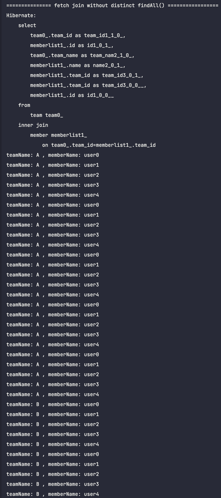
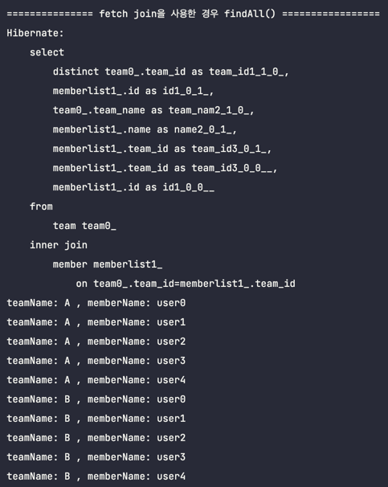

<div align="center">
    <h2>N + 1 문제</h2>
</div>

## 즉시 로딩
```java
// Team

@Entity
@Getter
@NoArgsConstructor(access = AccessLevel.PROTECTED)
public class Team {

    @Id @GeneratedValue
    @Column(name = "teamId")
    private Long id;

    @Column(nullable = false)
    private String teamName;

    @OneToMany(mappedBy = "team", fetch = FetchType.EAGER)
    private List<Member> memberList = new ArrayList<>();

    @Builder
    public Team(String teamName) {
        this.teamName = teamName;
    }
}
```

```java
// Member
@Entity
@Getter
@NoArgsConstructor(access = AccessLevel.PROTECTED)
public class Member {

    @Id
    @GeneratedValue
    private Long id;

    @Column(nullable = false)
    private String name;

    @ManyToOne(fetch = FetchType.EAGER)
    @JoinColumn(name = "teamId", nullable = false)
    private Team team;

    @Builder
    public Member(String name, Team team) {
        this.name = name;
        this.team = team;
        team.getMemberList().add(this);
    }

}
```

### Test Code
```java
    @Test
    public void 지연로딩_즉시로딩_비교() throws Exception {
        // given
        Team team = Team.builder()
                .teamName("A")
                .build();

        // when
        Team savedTeam = teamRepository.save(team);
        IntStream.range(0, 5)
                .mapToObj(i -> Member.builder()
                        .name("user" + i)
                        .team(savedTeam)
                        .build()).forEach(member -> memberRepository.save(member));
        flushAndClear();

        // then
        log.info("\n=============== findAll() =================");
        List<Team> teamList = teamRepository.findAll();
        flushAndClear();
        log.info("\n=============== findById() =================");
        Team findTeam = teamRepository.findById(savedTeam.getId())
                .orElseThrow(RuntimeException::new);
        log.info("\n=============== 지연로딩 시 user0을 조회하기 위한 쿼리 발생 =================");
        findTeam.getMemberList().get(0);
    }
```

즉시 로딩으로 설정이 되어 있으므로 `teamRepository.findAll()` 호출 시 저장 된 모든 팀 엔티티가 조회된다.

하지만 이때 각 팀은 Member를 리스트로 저장하고 있기 떄문에 Member에 대한 모든 정보도 불러오기 위하여 다음과 같이 쿼리가 두 번 발생한다.


쿼리를 살펴보면 team을 조회하는 쿼리가 발생하고 이후에 member를 조회하는 쿼리가 추가적으로 발생하는 것을 볼 수 있다.

이는 즉시 로딩 설정에 의해 내가 원하지 않는 쿼리가 추가적으로 발생하는 것이다.

추가적으로 즉시 로딩을 하기 때문에 내가 조회한 팀에서 첫 번째 Member를 참조하더라도 새롭게 쿼리가 발생하지 않는 것을 확인할 수 있다.

만약 저장된 팀의 개수가 2개라면, 각 팀마다 속한 member를 조회하기 위한 쿼리가 두번 발생할 것이다.

따라서 `팀의 목록을 조회하는 쿼리` + `팀의 수` * `팀에 속한 member를 조회하는 쿼리` 만큼 쿼리가 나가게 되고 이를 `N + 1`문제라고 한다.

> 아래 결과는 위 테스트 코드에서 Team을 두 개 저장하고 각 팀마다 Member를 5명씩 저장했을 때 발생하는 쿼리다. Member 테이블을 조회하는 쿼리가 예상대로 두 번 발생하는 것을 확인할 수 있다.


## 지연 로딩

```java
// Team

@Entity
@Getter
@NoArgsConstructor(access = AccessLevel.PROTECTED)
public class Team {

    @Id @GeneratedValue
    @Column(name = "teamId")
    private Long id;

    @Column(nullable = false)
    private String teamName;

    @OneToMany(mappedBy = "team", fetch = FetchType.LAZY)
    private List<Member> memberList = new ArrayList<>();

    @Builder
    public Team(String teamName) {
        this.teamName = teamName;
    }
}
```

```java
// Member
@Entity
@Getter
@NoArgsConstructor(access = AccessLevel.PROTECTED)
public class Member {

    @Id
    @GeneratedValue
    private Long id;

    @Column(nullable = false)
    private String name;

    @ManyToOne(fetch = FetchType.LAZY)
    @JoinColumn(name = "teamId", nullable = false)
    private Team team;

    @Builder
    public Member(String name, Team team) {
        this.name = name;
        this.team = team;
        team.getMemberList().add(this);
    }

}
```

지연 로딩으로 설정을 한 후 동일한 테스트를 돌려보면 결과는 다음과 같다.


즉시 로딩을 할 때와는 다르게 findAll(), findById()를 호출할 때 내가 원하는 Team 엔티티 정보만 조회하는 것을 확인할 수 있다.

따라서 불필요한 쿼리가 발생하지 않는다.

또한 지연 로딩을 사용하면 프록시 객체가 반환되기 때문에 team의 memberList를 참조하는 순간에 쿼리가 발생한다.

`N + 1` 문제가 해결된 것처럼 보인다. 하지만 실제로는 그렇지 않다. 다음 예제를 통해 여전히 문제가 남아있음을 확인해 보자.

### Test Code
```java
    @Test
    public void 지연로딩_Team이_여러_개_저장된_경우() throws Exception {
        // given
        Team team1 = Team.builder()
                .teamName("A")
                .build();
        Team team2 = Team.builder()
                .teamName("B")
                .build();

        // when
        Team savedTeam1 = teamRepository.save(team1);
        Team savedTeam2 = teamRepository.save(team2);
        IntStream.range(0, 5)
                .mapToObj(i -> Member.builder()
                        .name("user" + i)
                        .team(savedTeam1)
                        .build()).forEach(member -> memberRepository.save(member));
        IntStream.range(0, 5)
                .mapToObj(i -> Member.builder()
                        .name("user" + i)
                        .team(savedTeam2)
                        .build()).forEach(member -> memberRepository.save(member));
        flushAndClear();

        // then
        log.info("\n=============== findAll() =================");
        List<Team> teamList = teamRepository.findAll();
        log.info("\n=============== 프록시 객체의 user들을 조회하기 위한 쿼리 발생 =================");
        teamList.forEach(
                t -> {
                    t.getMemberList()
                            .forEach(
                                    member -> System.out.println(member.getName())
                            );
                }
        );
    }
```


실행 결과를 보면 나중에 각 팀마다 소속된 팀원들의 이름을 출력하기 위해 member를 조회하는 쿼리가 두 번 발생하는 것을 볼 수 있다.

내가 member에 대한 정보를 조회하는 시점에 쿼리가 발생한다는 점에서 즉시 로딩을 하는 경우보다 성능 상 이점이 존재한다.

하지만 이는 즉시 로딩을 할 떄와 다른 점은 그저 조회 쿼리를 날리는 시점으 늦춰질 수 있다는 점 뿐이다. 쿼리 로그를 보면 결국 N + 1 문제가 발생했을 때와 똑같다.

그렇다면 JPQL로 Join문을 내가 직접 작성해주면 해결되지 않을까?

## join문 작성하기

```java
@Query("select distinct t from Team t join t.memberList")
List<Team> findAllByJoin();
```
위와 같이 쿼리를 작성하였다.

즉 member들의 team id와 일치하는 모든 Team 엔티티를 조회하는 쿼리이다. 이렇게 조회를 한다면 Team에 소속 멤버들을 한번에 가져올 수 있을 것 같다.

하지만 테스트 결과는 다음과 같다.


조회하는 쿼리는 inner join으로 잘 나간듯 하다. 하지만 member를 조회하는 순간 여전히 불필요한 쿼리 두 번이 발생한다.

이유는 JPQL로 작성한 일반적인 join문은 Team의 칼럼들만 조회하고 join 대상의 영속성까지는 관여하지 않기 때문이다.

즉 내가 team의 member를 참조하기 전 까지는 여전히 지연 로딩 전략으로 인해 Team 객체는 프록시 객체인 것이다.

여전히 N + 1 문제가 발생하고 있다.

이를 해결하기 위해 fetch join 전략을 사용해 보자.

## Fetch join - 컬렉션 조회

팀들을 조회하면서 연관된 멤버들의 정보까지 조회하는 쿼리를 작성하려 한다.

```java
@Query("select t from Team t join fetch t.memberList")
List<Team> findAllByFetchJoinWithoutDistinct();
```



실행 결과를 보면 조회되는 user의 수가 중복되고 있는 것을 볼 수 있다. 팀의 개수는 2개, 각 팀 당 멤버 수는 5명이므로 조회 시 카티션 곱이 발생한다. 속히 말하는 데이터 뻥튀기가 발생한다.

당연히 일대다 관계인 Member를 조인하므로 그런 것이다. 이런 중복 데이터를 없애기 위해서는 SQL의 distinct로 해결하였다. 하지만 distinct의 경우 모든 칼럼의 값이 동일한 경우에 중복이 제거된다. 그러니 중복이 제거되지 않을 것이다.

그러나 JPQL의 distinct는 기존 SQL의 distinct와 다르게 동작한다.

> 1. SQL에 distinct를 추가
> 2. 애플리케이션에서 엔티티 중복 제거

따라서 쿼리를 조금 수정하여 실행결과를 살펴보자.

```java
@Query("select distinct t from Team t join fetch t.memberList")
List<Team> findAllByFetchJoin();
```



아래와 같이 teamA에 속한 5명, teamB에 속한 5명에 대한 총 10개의 이름이 출력되는 것을 확인할 수 있다. 따라서 fetch join을 통해 컬렉션을 조회하는 경우에는 distinct를 반드시 붙여줘야 한다.

## Fetch join - 엔티티 조회

이번엔 반대로 Member 정보를 조회하면서 팀을 조회하는 상황을 살펴볼 것이다.


member를 모두 조회한 후 이름 및 소속 팀명을 출력하도록 하였다. 

쿼리문을 살퍄보면 Team의 경우 프록시 객체로 조회되어 team을 조회하는 지연 쿼리가 발생하고 있다. 

그런데 쿼리가 총 두번 발생한다. 이는 최초 TeamA의 이름을 출력하기 위해 쿼리가 나간 후 TeamA는 1차 캐시에 저장된다. 따라서 이후 TeamA에 속한 member의 정보를 출력할 때에는 쿼리가 발생하지 않는다.

그러다 TeamB의 이름을 출력해야 할 때 1차 캐시에 존재하지 않으므로 TeamB를 조회하는 쿼리가 발생한다.

만약 회원의 수가 100명이고 팀이 모두 다르다면, 회원을 조회하고 소속 팀에 대한 정보를 필요로 하는 요청이 발생했을 때 팀을 조회하는 쿼리는 100번이 추가적으로 발생할 것이다. 즉 N + 1문제가 발생한다.

이 시점에 fetch join을 사용하여 똑같이 모든 Member를 조회해 보자.

아래와 같이 쿼리문을 작성하고 테스트 결과를 살펴보자.

```java
@Query("select m from Member m join fetch m.team")
List<Member> findAllByFetchJoin();
```


쿼리를 보면 member를 조회하면서 동시에 연관된 team 정보를 모두 조회하는 것을 알 수 있다.

## Fetch join의 한계점

1. **fetch join 대상에 별칭 지정 불가능**
```sql
select distinct t from Team t join fetch t.memberList ml where ml.username = 'user1' 
```

fetch joind은 join 대상을 모두 조회한다는 의미이다. 

모든 엔티티를 조회하지 않고 일부만 조회하려는 행위는 위험하다.
   
2. **둘 이상의 컬렉션 fetch join 불가능**

만약 조회하려는 컬렉션이 두 개 이상이라면 fetch join을 사용할 수 없다.

3. **페이징 처리 불가능**

fetch join은 연관된 모든 데이터를 조회하는 것이라고 앞서 말했다. 또한 데이터 조작을 방지하기 위해 별칭도 사용하지 못했다.
 
일대일, 다대일 같은 경우에는 단일 엔티티를 fetch join하기 때문에 가능하다.

하지만 컬렉션 조인의 경우 데이터 뻥튀기가 발생하고 페이징 처리를 하는 경우 온전한 데이터가 조회된다고 볼 수 없고 하이버네이트는 에러를 발생시킨다.

페이징 처리를 위해서는 다대일 조인 쿼리문을 일대다 조인 쿼리로 바꿔서 조회하거나 BatchSize를 설정하는 방법이 있다.

페이징 처리를 만약 한다면 애플리케이션 단에서 페이징 처리를 해서 보여준다. 따라서 fetch join 시 페이징 처리는 절대로 하지 말아야 한다.   

**다대일 fetch join**
```sql
select m from Member m join fetch m.team
```

## BatchSize
```java
@BatchSize(size = 100)
@OneToMany(mappedBy = "team", fetch = FetchType.LAZY))
List<Member> memberList = new ArrayList<>(); 
```
batchSize 옵션은 지정한 size 만큼 연관 데이터를 한번에 미리 조회하는 것이다. 

따라서 페이징 처리가 가능하고 N + 1 문제도 해결할 수 있다. 

아래와 같이 BatchSize를 지정하고 페이징 처리를 적용했을 때 결과를 보자.


쿼리문을 살펴보면 team에 대하여 페이징 처리가 적용되었고 그 개수에 맞는 member 컬렉션을 조회하는 것을 볼 수 있다.

따라서 문제가 제대로 해결되었다. 보통 실무에선 batchSize를 1000이하로 설정하여 사용한다고 한다.

## 정리
- `ToOne` 으로 끝나는 관계의 경우 반드시 `LAZY 로딩 전략` 선택하기
- 지연 쿼리로 인한 성능 저하를 막기 위해 `fetch join` 사용하기
  - 일대다 관계에서 컬렉션을 조회하는 경우 `별칭 설정 불가`
  - 페이징 처리 불가
  - 데이터 뻥튀기 주의 -> `distinct` 로 해결
  - 두 개 이상의 컬렉션을 동시에 fetch join하지 않기
- 페이징 처리와 fetch join을 사용해야 한다면?
  - `BatchSize` 설정하여 원하는 수 만큼 연관 데이터 미리 조회하기